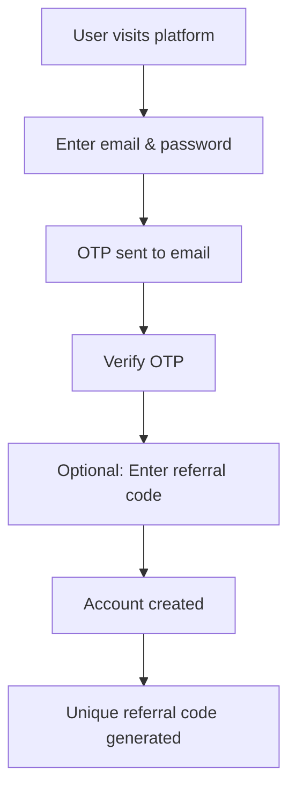
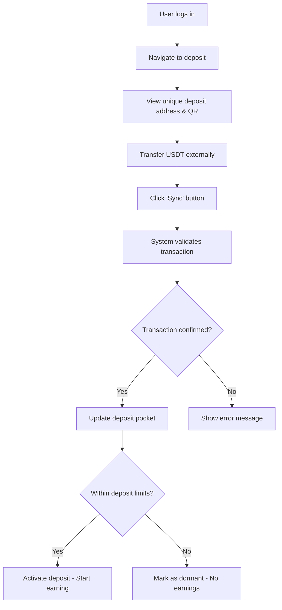
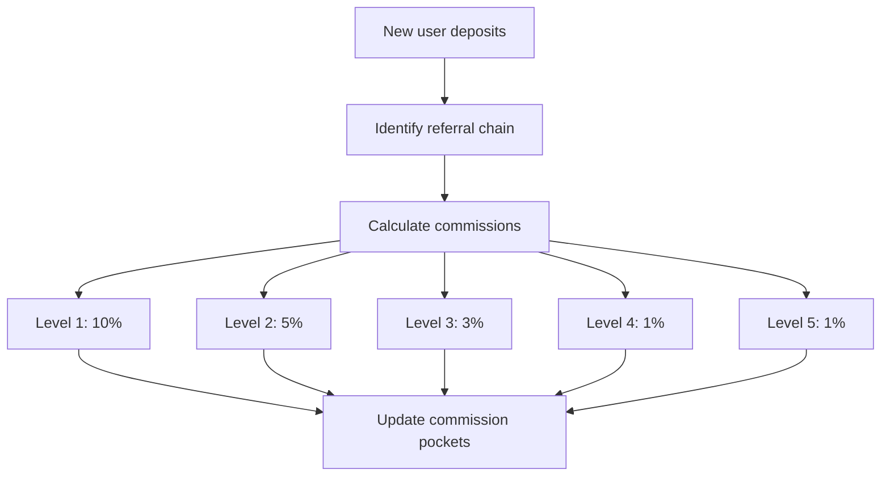

# Yield Cycle Platform - Investment & Referral System

## 🌟 Executive Summary

The Yield Cycle Platform is a blockchain-based investment system built on Binance Smart Chain (BSC) that enables users to deposit USDT and earn guaranteed monthly returns through a structured yield program. The platform combines traditional investment returns with a multi-level referral commission structure, providing multiple earning opportunities for participants.

## 📋 Table of Contents

- [System Overview](#system-overview)
- [User Types & Access Levels](#user-types--access-levels)
- [Core Features](#core-features)
- [Technical Architecture](#technical-architecture)
- [User Flows](#user-flows)
- [Deposit System](#deposit-system)
- [Referral & Commission System](#referral--commission-system)
- [Wallet Management](#wallet-management)
- [Admin Dashboard](#admin-dashboard)
- [Security & Compliance](#security--compliance)

## 🎯 System Overview

### Platform Objectives

- Provide secure USDT investment opportunities with guaranteed 8% monthly returns
- Create a sustainable referral-based growth mechanism
- Maintain full transparency and user control over investments
- Ensure regulatory compliance and security best practices

### Key Statistics

- **Investment Duration**: 25 months lock-in period
- **Monthly Returns**: 8% of deposited amount
- **Total Returns**: 200% of initial deposit over 25 months
- **Referral Levels**: 5-tier commission structure
- **Total Commission**: 20% of each new deposit distributed across referral chain
- **Blockchain**: Binance Smart Chain (BSC)
- **Supported Token**: USDT (Tether)

## 👥 User Types & Access Levels

### 1. Depositors (End Users)

- **Primary Role**: Investment participants
- **Capabilities**:
  - Register and manage personal accounts
  - Make USDT deposits within defined limits
  - Track investment performance and earnings
  - Manage referral network and earn commissions
  - Withdraw funds after lock-in period

### 2. Administrators

- **Primary Role**: Platform management and oversight
- **Capabilities**:
  - Complete system monitoring and analytics
  - User account management
  - Transaction oversight and validation
  - Financial reporting and audit trails
  - System configuration and limits management

## 🚀 Core Features

### Authentication & Security

- **Registration**: Email-based with OTP verification
- **Login**: Email/password with mandatory login OTP
- **Security**: Multi-factor authentication for all transactions
- **Data Protection**: End-to-end encryption for sensitive data

### Investment Management

- **Flexible Deposits**: Configurable minimum and maximum limits
- **Guaranteed Returns**: 8% monthly yield for 25 months
- **Real-time Tracking**: Live investment performance monitoring
- **Automated Calculations**: System-managed earnings distribution

### Referral System

- **5-Tier Structure**: Multi-level commission distribution
- **Unique Codes**: Every user receives a personal referral code
- **Instant Commissions**: Immediate distribution upon new deposits
- **Team Visualization**: Tree-structure team management interface

## 🏗️ Technical Architecture

### Blockchain Integration

- **Network**: Binance Smart Chain (BSC)
- **Token Standard**: BEP-20 (USDT)
- **Wallet Integration**: HD (Hierarchical Deterministic) wallet structure
- **Transaction Monitoring**: Real-time blockchain event listening

### Wallet Architecture

```
Central Custodian System
├── Collection Wallet (Master)
│   ├── User Deposit Address 1
│   ├── User Deposit Address 2
│   └── ... (Derived addresses)
└── Payout Wallet
    └── Withdrawal distributions
```

### Data Management

- **User Accounts**: Secure profile and authentication data
- **Investment Tracking**: Real-time deposit and earnings monitoring
- **Referral Network**: Tree-structured relationship mapping
- **Transaction History**: Complete audit trail for all operations

## 📱 User Flows

### Registration Flow



### Deposit Flow



### Commission Distribution Flow



## 💰 Deposit System

### Deposit Process

1. **Address Generation**: Each user receives a unique BSC address derived from the master wallet
2. **External Transfer**: Users transfer USDT to their assigned deposit address using external wallets
3. **Manual Sync**: Users click "Sync Deposits" button to check for incoming transactions
4. **Validation**: System validates transaction on blockchain (12 confirmations required)
5. **Credit Assignment**: Successful transactions update user's active deposits pocket

### Deposit States

- **Active**: Deposits within user limits, earning 8% monthly returns
- **Dormant**: Deposits exceeding user limits, no earnings generated

### Limits Management

- **Individual Limits**: Configurable per-user maximum deposit amounts
- **System Limits**: Global platform-wide deposit restrictions
- **Overflow Handling**: Excess deposits marked as dormant until limits adjusted

### Example Scenario

```
User Limit: $1,000 USDT
Current Deposits: $800 USDT
New Transfer: $500 USDT

Result:
- $200 USDT → Active (reaches limit)
- $300 USDT → Dormant (exceeds limit)
```

## 🌳 Referral & Commission System

### Commission Structure

| Level     | Relationship    | Commission Rate | Example (on $1,000) |
| --------- | --------------- | --------------- | ------------------- |
| 1         | Direct Referral | 10%             | $100                |
| 2         | Grand-parent    | 5%              | $50                 |
| 3         | Level-3 Upline  | 3%              | $30                 |
| 4         | Level-4 Upline  | 1%              | $10                 |
| 5         | Level-5 Upline  | 1%              | $10                 |
| **Total** | **Distributed** | **20%**         | **$200**            |

### Team Structure

```
User A (Root)
├── User B (Level 1)
│   ├── User E (Level 2)
│   └── User F (Level 2)
├── User C (Level 1)
│   └── User G (Level 2)
└── User D (Level 1)
```

### Commission Features

- **Instant Distribution**: Commissions credited immediately upon deposit confirmation
- **Multi-level Tracking**: Complete visibility into downline team performance
- **Earnings Limits**: Commission stops when user reaches maximum earning capacity
- **Team Analytics**: Detailed insights into referral network performance

## 💼 Wallet Management

### Pocket System

Each user maintains three distinct tracking pockets:

#### 1. Active Deposits Pocket

- **Purpose**: Tracks current active USDT deposits (earning 8% monthly)
- **Updates**: Incremented/decremented based on deposit status changes
- **Display**: Shows only deposits that are actively earning returns
- **Note**: Dormant deposits (exceeding limits) are not included here

#### 2. Income Pocket

- **Purpose**: Tracks monthly 8% earnings from active deposits
- **Updates**: Automated monthly distribution for 25 months
- **Calculation**: 8% of active deposit amount
- **Source**: Active deposits only

#### 3. Commission Pocket

- **Purpose**: Tracks referral commission earnings
- **Updates**: Real-time upon downline team deposits
- **Source**: 5-level commission structure (10%, 5%, 3%, 1%, 1%)

#### Total Earnings Display (Calculated)

- **Calculation**: Income Pocket + Commission Pocket
- **Limits**: Capped at 200% of total deposits
- **Status**: Shows progress toward maximum earning capacity
- **Purpose**: Combined view of all earnings for user convenience

### Withdrawal System

- **Lock Period**: 25 months from first deposit
- **Eligibility**: Available after investment tenure completion
- **Process**: Users provide external wallet address for fund transfer
- **Source**: Funds transferred from Central Payout Wallet
- **Scope**: Complete withdrawal of all pocket balances

## 🎛️ Admin Dashboard

### System Overview

- **Total Users**: Platform-wide user statistics
- **Total Deposits**: Aggregate deposit tracking across all users
- **Active vs Dormant**: Breakdown of deposit states
- **Monthly Distributions**: Automated payment tracking

### User Management

- **User Profiles**: Complete user account information
- **Deposit History**: Individual and aggregate deposit tracking
- **Earnings Overview**: Income and commission pocket monitoring
- **Team Visualization**: Hierarchical referral network display

### Financial Management

- **Central Wallet Monitoring**: Real-time balance tracking
  - Collection Wallet balance
  - Payout Wallet balance
- **Transaction Oversight**: Complete transaction audit trail
- **Earnings Distribution**: Automated and manual payment processing
- **Limits Administration**: System-wide and individual limit management

### Analytics & Reporting

- **Performance Metrics**: Platform growth and user engagement
- **Financial Reports**: Comprehensive earning and distribution reports
- **Team Analytics**: Referral network performance insights
- **Compliance Reporting**: Regulatory and audit trail documentation

## 🔒 Security & Compliance

### Blockchain Security

- **HD Wallet Structure**: Hierarchical deterministic address generation
- **Private Key Management**: Secure key storage and rotation
- **Transaction Monitoring**: Real-time blockchain event processing
- **Smart Contract Integration**: Automated transaction validation

### Data Protection

- **Encryption**: End-to-end encryption for sensitive data
- **Authentication**: Multi-factor authentication for all operations
- **Session Management**: Secure session handling and timeout
- **Audit Trails**: Complete logging of all system activities

### Regulatory Compliance

- **KYC Integration**: Identity verification processes
- **AML Monitoring**: Anti-money laundering transaction screening
- **Reporting Standards**: Compliance with financial regulations
- **Data Privacy**: GDPR and privacy regulation adherence

## 📈 Platform Economics

### Revenue Model

- **User Returns**: 8% monthly (200% total over 25 months)
- **Platform Retention**: 80% of each deposit after commission distribution
- **Commission Distribution**: 20% across 5-level referral chain
- **Operational Margin**: Derived from deposit retention and growth

### Example Economics (1,000 USDT Deposit)

```
User Deposit: $1,000
├── Referral Commissions: $200 (20%)
├── User Returns: $2,000 (200% over 25 months)
└── Platform Retention: $800 (Initial operational margin)
```

### Sustainability Factors

- **Growth-driven Model**: New deposits fund existing obligations
- **Controlled Limits**: Maximum deposit caps ensure manageable obligations
- **Dormant Deposits**: Excess deposits provide additional operational buffer
- **Commission Structure**: Incentivizes sustainable growth patterns

---

## 📞 Support & Documentation

For technical implementation details, API documentation, and system architecture specifications, please refer to the comprehensive developer documentation or contact the development team.

**Platform Version**: 1.0  
**Last Updated**: [Current Date]  
**Documentation Status**: Draft for Stakeholder Review
